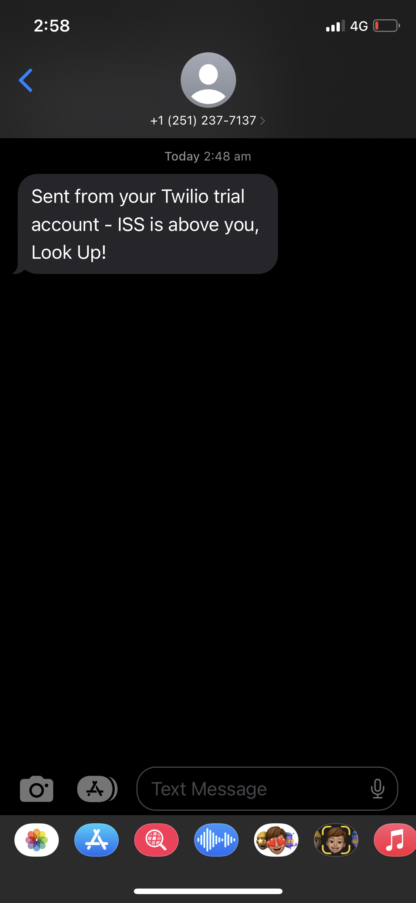

# ISS Tracker

## Table of Contents
- Description
- GitGub Link
- Technologies used
- Pre-requisites
- Screenshots

## Description
This program utilizes the requests library to fetch real-time ISS location data from the "http://api.open-notify.org/iss-now.json" API. It also uses the twilio library to send SMS messages. Here's a high-level overview of the program's functionality:

The program first collects the user's location (latitude and longitude) or allows the user to input their location manually.

It continuously fetches the ISS's current location from the Open Notify API and compares it to the user's location.

When the ISS is above the user's location (within a certain threshold), the program sends an SMS notification using the Twilio API.

## GitHub Link
https://github.com/zafarfast/isst498234582

## Technologies used:
- Requests
- Twilio

## Pre-requisites

- Twilio account: To run the program you will need Account SID and Auth Token. This can be obtained by registering with Twilio at https://www.twilio.com/try-twilio

- Location co-ordinates: You can obtain the co-ordiantes of you location on Google map.  A details guide can be found here > https://www.howtogeek.com/689097/how-to-get-latitude-and-longitude-coordinates-from-google-maps/

## Screenshots

